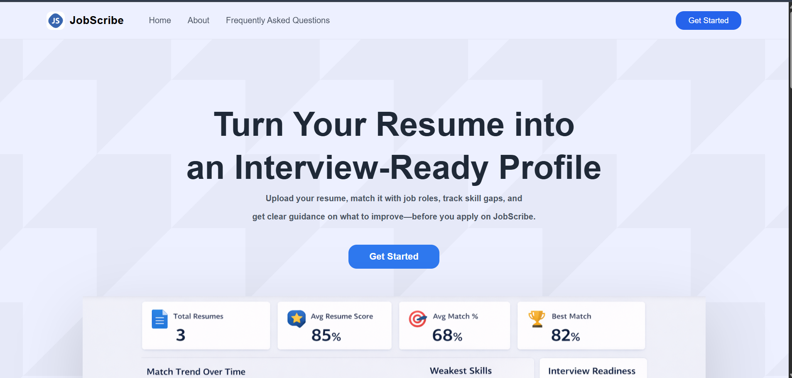
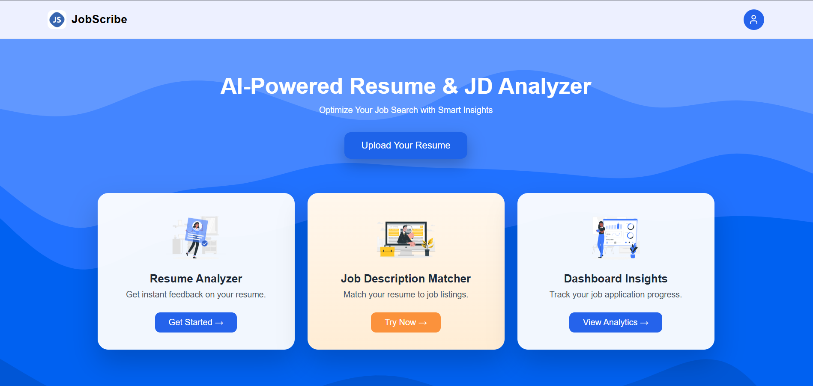
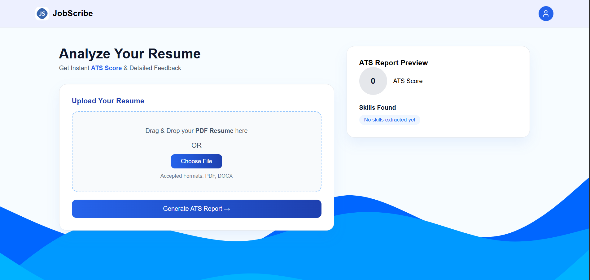
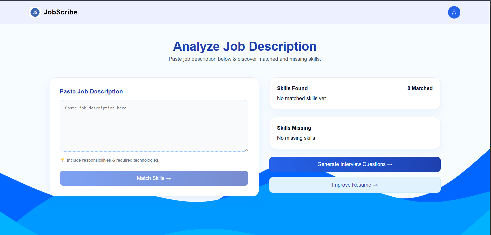

# 🚀 JobScribe – AI-Powered Resume & JD Analyzer

JobScribe is a full-stack AI-powered web application that helps users optimize their resumes for job applications.  
It analyzes resumes, calculates ATS scores, matches resumes with job descriptions, identifies skill gaps, and generates AI-based interview questions and improvement suggestions.

---

## 🌟 Features

- 🔐 User Authentication (Register/Login)
- 🔎 Google OAuth Integration
- 📄 Resume Upload (PDF/DOCX)
- 📊 ATS Score Generation
- 🧠 AI-Based Resume Analysis
- 📝 Job Description Matching
- 📈 Skill Gap Identification
- 💬 AI-Generated Interview Questions
- ✨ AI Resume Improvement Suggestions
- 📊 Interactive Dashboard with analytics
- 👤 Profile Management

---
## 📸 Screenshots

### 🏠 Home Page


### 🏠 Main Dashboard


### 📄 Resume Analysis


### 📝 JD Matching


---

## 🛠 Tech Stack

### Frontend
- React (Vite)
- CSS Modules
- Axios
- React Router
- Context API

### Backend
- Node.js
- Express.js
- MongoDB
- Mongoose
- JWT Authentication
- Google OAuth
- Cloudinary (File Uploads)
- AI Integration APIs

---

## 📁 Project Structure

```bash
JobScribe
│
├── Backend
│   ├── controllers
│   ├── models
│   ├── routes
│   ├── services        # AI logic
│   ├── middleware
│   └── server.js
│
└── Frontend
    ├── Pages
    ├── Components
    ├── Context
    ├── Routes
    └── main.jsx
```

## ⚙️ Installation & Setup

### 1️⃣ Clone the Repository

```bash
git clone https://github.com/your-username/jobscribe.git
cd jobscribe
```

2️⃣ Backend Setup
```
cd Backend
npm install
```
Create a .env file inside the Backend folder:
```
PORT=5000
MONGO_URI=your_mongodb_connection
JWT_SECRET=your_secret_key
GOOGLE_CLIENT_ID=your_google_client_id
GOOGLE_CLIENT_SECRET=your_google_client_secret
CLOUDINARY_CLOUD_NAME=your_cloud_name
CLOUDINARY_API_KEY=your_api_key
CLOUDINARY_API_SECRET=your_api_secret
AI_API_KEY=your_ai_api_key
```

Run Backend:
```
npm start
```
3️⃣ Frontend Setup
```
cd Frontend
npm install
npm run dev
```

## 🚀 How It Works

1. User registers or logs in (Email or Google).
2. Uploads resume (PDF/DOCX).
3. System generates:
   - ATS Score
   - Extracted Skills
   - Improvement Suggestions
4. User pastes Job Description.
5. System compares resume with JD:
   - Matched Skills
   - Missing Skills
6. AI generates interview questions based on the Job Description.
7. Dashboard displays resume analytics and match trends.

---

## 📊 Dashboard Insights

- Resume Score Tracking  
- Match Percentage Trends  
- Weakest Skills Breakdown  
- Skill Heatmap  
- Interview Readiness Score  
- Recent Job Matches  

---

## 📦 Deployment

- **Frontend:** Vercel / Netlify  
- **Backend:** Render / Railway / AWS  

---

## 👨‍💻 Author

**Abhishek Sarkar**
